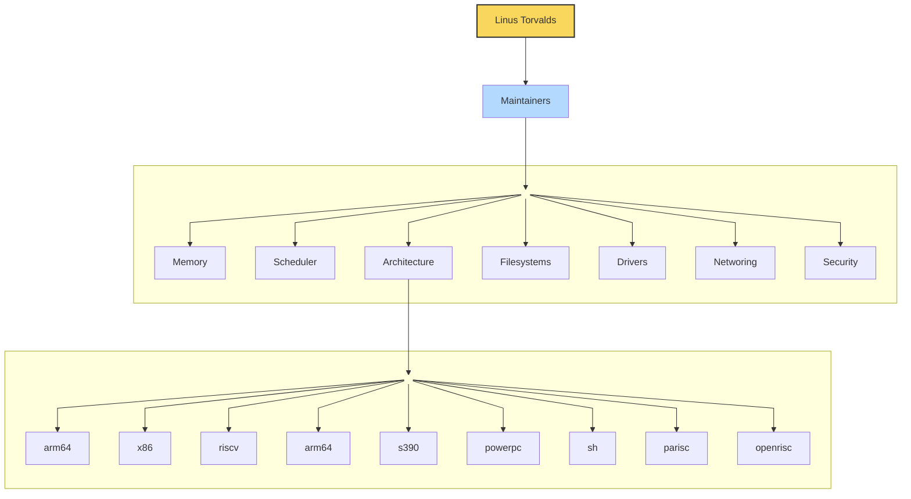
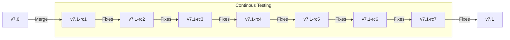
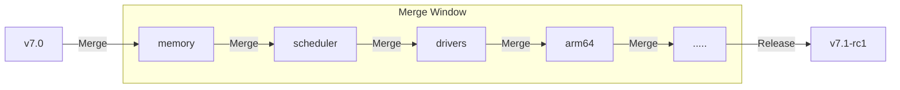

### Overview

Linux kernel is maintained by `Linus Torvalds` who receives code changes from various subsystem and platform `maintainers` who in turn work with developers from across the world for continuous development, review, test and release. There are three different kernels `next`, `upstream`, and `stable` which are publicly maintained.



### Process

 Developers across the world submit patches on various subsystem specific public mailing lists which then gets reiviewed before being finally accepted or rejected with comments. These accepted patches eventually make their way to maintainers branch which gets periodically pulled in by Linux each merge window and a kernel release is published after multi week long testing.

 ```mermaid
 flowchart LR
    A[Developer]
    B[Reviewers]
    C[Maintainer]
    D[Linus]
    E[Mainline]

    A -->|Patch| B
    B -->|Review| A
    B -->|Accepted| C
    C -->|Pull Request| D
    D -->|Published| E
 ```

 ### Linux Release

 Kernel release happen periodically once every `ten weeks` approximately which includes `two weeks` merge window followed by `eight weeks` continuous testing and fixing. New functions could only be pulled in during merge window but not during testing phase. Remaining features (if any) will have to wait for next window.



 The process starts with a two weeks `merge window` when Linus pulls in branches from maintainers containing reviewed and accepted features. These merges happen one after the other till all pull requests have been processed. Linus also fixes merge conflicts (if any) during this merging process. Afterwards `rc1` candidate is released.



Basically a fix could go in any time during kernel release process but a function could go in only during the merge window. Now let's look at how function development happens which gets eventually pulled in during merge.

<git://git.kernel.org/pub/scm/linux/kernel/git/torvalds/linux.git>

### Linux Development

Functional development for next kernel release happens during the same `RC window` where the current version is also getting tetsed for final release. Unlike fixes maintainer accepted new functional patches remain in respetive subsystem branches which regularly get pulled into `linux-next` for continuous testing. Any final pull request for Linus during merge window should have been tested via `linux-next` over the `RC window` weeks. But these policies might be subjective depending on particular subsystem scenario.

 ```mermaid
 flowchart LR
    A[Developer]
    B[Reviewers]
    C[Maintainer]
    D[Branch]
    E[Pull Request]
    F[Linux Next]
    G[Release RC1]
    H[CI/CD - Testing]

    subgraph Function Development Cycle
        A --> B
        B --> C
    end
    C -->|Forced Update| D
    D -->|Merge Window| E
    E --> G
    D -->|Weekly pull| F
    F --> H
```

### Linux Next

`Linux-next` is an intermediate kernel branch which maintains snapshot for entire active kernel development by pulling current subsystem branches from various maintainers frequently. Although the tag release periodicity is not really fixed but it's about two or three days. Overall there are two distinct objectives.

1. Manage Merge Conflicts
    - Development happens independently in different subsystems
    - Accepted patches across different branches might conflict during merge
    - Linux-next fixes those conflicts while also informing respective maintainers

2. Testing
    - Creates an opportunity for real comprehesive testing for all the upcoming release
    - Fix problems before the `merge window`
    - Reduces bugs during subsequent `RC cycle`

Linux-next is not indended for end use but instead it aids in kernel development before every release merge window.

<git://git.kernel.org/pub/scm/linux/kernel/git/next/linux-next.git>

### Linux Stable

Certain kernel releases are `selected` to be maintained as `stable releases`. All future `fixes` but certain functional performance `commits` get back ported into these `stables release` till their `end of life`. These stable releases are actually intended for end use. Commercial Linux distribution derive their kernel from these official stable releases.

Please note that not all kernel releases become stable kernel. There are multiple parameter based considerations which o into selecting these stable release candidates that are maintained over the years.

<git://git.kernel.org/pub/scm/linux/kernel/git/stable/linux.git>

### Linux Downstream

Commerical kernel releases for production quality end use case are always based on stable kernel releases maintained in the community. Although downstream kernels might contain additional changes applied on top of these stable releases.
